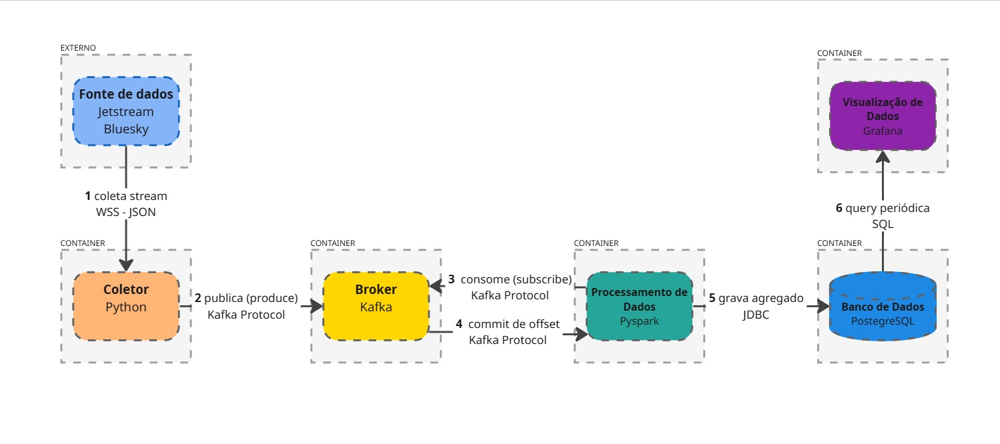

# bluesky-realtime-analytics

Pipeline de ingestão, processamento e visualização de dados em tempo real da rede social Bluesky, projeto de aplicação distribuída para a disciplina de Sistemas Distribuidos.

## Proposta do projeto

Implementar um pipeline distribuído de dados em tempo real consumindo
o stream público da rede social Bluesky, com processamento por Apache
Spark e visualização em dashboards no Grafana.

## Arquitetura do sistema

## Tecnologias

| Componente | Tecnologia | Função |
|---|---|---|
| Fonte de dados | Bluesky Jetstream | Realiza stream contínuo de eventos da rede social Bluesky em formato JSON |
| Coletor | Python | Consome stream de eventos e publica mensagens no Kafka |
| Broker | Apache Kafka | Armazena e distribui mensagens em tópicos |
| Processamento | Apache PySpark | Executa transformações e agregações nos dados vindos do Kafka e escreve os resultados no banco |
| Banco de dados | PostgreSQL | Armazena os dados analíticos em tabelas para consulta e visualização |
| Visualização | Grafana | Exibe os dados em dashboard com atualização automática |

## Fluxos de comunicação

**1 → coleta stream - WSS JSON**  
O Coletor abre uma conexão WebSocket com o Jetstream do Bluesky e recebe eventos continuamente em formato JSON.

**2 → publica (produce) - Kafka Protocol**  
O Coletor publica uma mensagem em tópicos do Kafka por evento recebido.

**3 → consome (subscribe) - Kafka Protocol**  
O PySpark se inscreve e consome o tópico Kafka, recebendo os eventos publicados pelo Coletor.

**4 → commit de offset - Kafka Protocol**  
O PySpark confirma os offsets processados, garantindo tolerância a falhas e retomada sem perda de dados.

**5 → grava agregado - JDBC**  
O Pyspark escreve os dados processados(transformação e agregação) no PostgreSQL por JDBC.

**6 → query periódica - SQL**  
O Grafana executa busca no PostgreSQL para atualizar o dashboard.

## Fonte de dados

Este projeto utiliza o [Bluesky Jetstream](https://github.com/bluesky-social/jetstream) 
como fonte de dados.
